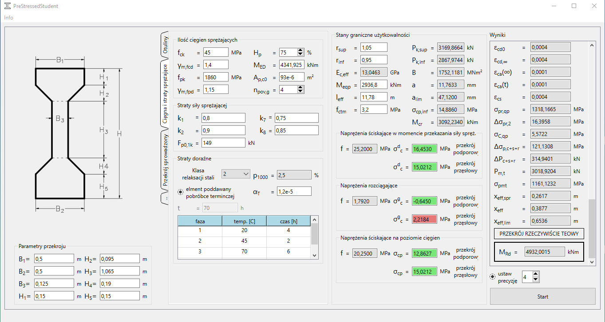

# PreStressedStudent

⚠️ **Note:** This project was created as part of a diploma thesis and is currently awaiting refactoring for better readability and maintainability.

---

## 🎯 Project Description

**PreStressedStudent** is a C++/Qt desktop application designed to support the **design of prestressed concrete beams** (strunobeton) according to **Eurocode 2 (PN-EN 1992-1-1)** in the field of both **Ultimate Limit State (ULS / SGN)** and **Serviceability Limit State (SLS / SGU)**.

The main idea behind the project was to provide an **intuitive tool** for engineering students and practitioners while covering a **broad scope of calculations** for prestressed concrete design.

The application was developed in **C++** using the **Qt framework** for the GUI. Compilation and development were carried out in **QtCreator**.

---

## 🖼️ Screenshot

Example of the main window of the application:

---

## ✨ Features

The program allows you to:

- ✅ Verify whether the selected cross-section meets the slenderness condition  
- ✅ Calculate the required **number of tendons** to transfer the applied bending moment  
- ✅ Determine **concrete cover** requirements depending on exposure class and environmental aggressiveness  
- ✅ Compute **geometrical characteristics** of the section (concrete + steel)  
- ✅ Calculate the **creep coefficient**  
- ✅ Estimate **prestress losses** due to rheological (long-term) and immediate effects  
- ✅ Perform **deflection checks** and compute the **critical moment** to verify cracking conditions  

Additional advantages:
- Faster design workflow for prestressed concrete beams  
- Flexible choice of parameters:
  - Exposure class  
  - Section class  
  - Steel relaxation class  
  - Type of prestressing (bars, wires, strands)  

This makes the tool **versatile and practical** for different prestressed concrete design scenarios.

---

## 🛠️ Tools & Technologies

- **Programming language:** C++17  
- **Framework:** Qt (for GUI) → [Qt.io](https://www.qt.io/)  
- **IDE / Build tool:** QtCreator → [Qt Creator](https://en.wikipedia.org/wiki/Qt_Creator)  

---

## 📖 Verification

The results obtained in the application were verified in two ways:
1. By hand calculations for two selected beams.  
2. By comparison with an independent algorithm implemented in Microsoft Excel.  

---

## 📂 Repository Structure

/src - C++ source files
/inc - C++ header files
/doc - HTML documentation (Doxygen)
/assets - images and screenshots (e.g. Dzwigar.png)

---

## 📚 Standards & References

- **PN-EN 1992-1-1 Eurocode 2**: Design of concrete structures – Part 1-1: General rules and rules for buildings  
- Supporting literature on prestressed concrete beam design (included in the diploma thesis)  

---

## 📜 License

This project is licensed under the **MIT License**.  
You are free to use, modify, and adapt it for your own learning or engineering work.

